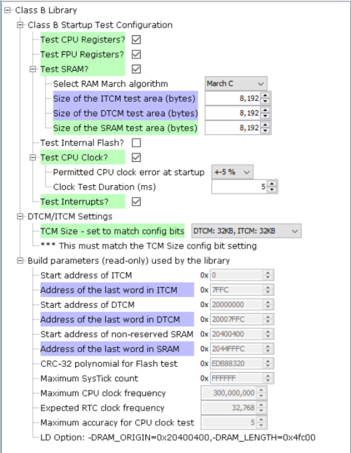
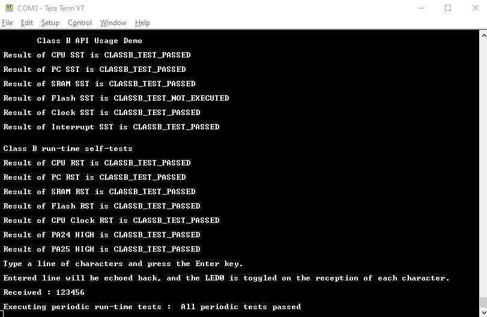

# SAM E70 S70 V70 V71 Class B API Usage Example

This example shows how to use the self-test APIs from the Class B library during startup as well as run-time.

## MHC configuration for the Class B component

Configuration for the Class B component in this application is shown below,

When a self-test is used at startup, it is referred as Startup Self-test (SST) and when it is used at
run-time, it is referred as run-time self-test (RST).
When this demo application starts, it reads the status of startup self-tests and sends them to the EDBG Virtual COM port.
It then executes a few run-time self-tests for different components inside microcontroller and reports
whether the tests are passed or not.
Before running the self-test for SRAM, cache memory is disabled to ensure that the accesses are on the
SRAM instead of the cache.
For the Flash memory self-test, CRC-32 for the internal flash memory from address 0x400000 to 0x450000 is calculated
and the CRC value is stored at address 0x450000 using EFC Library commands.
Since the Class B Library enables WDT during startup, it is necessary to clear the WDT periodically.
In the main loop, the application waits for characters received via the EDBG Virtual COM port.
When it receives a CR or LF character, it prints out the received text and calls a
function to execute specific run-time self-tests.
Refer the User Guide for the Class B Library for details on the self-tests. 

## Building The Application
The parent folder for the MPLAB X IDE project for this application is given below:

**Application Path** : \apps\mplabx\classb_api_usage\firmware

To build the application, open the project file classb_api_usage.X in MPLABX IDE.

## MPLAB Harmony Configurations

Refer to the MHC project graph for the components used and the respective configuration options.

## Hardware Setup

1. Project classb_api_usage.X
    * Hardware Used
        * SAM E70 Xplained Ultra
    * Hardware Setup
        * Ensure the the tested IO pins are kept at specified logic levels.

## Running The Application

1. Open the Terminal application (Ex.:Tera Term) on the computer.
2. Connect to the EDBG Virtual COM port and configure the serial settings as follows:
    * Baud : 115200
    * Data : 8 Bits
    * Parity : None
    * Stop : 1 Bit
    * Flow Control : None
3. Build and Program the application using the MPLAB X IDE.
4. Observe the messages shown on the console.
5. Type a line of characters and press Enter.
6. Observe the echoed line of text and the result of run-time self-tests.
7. Go to step 5.

## Debug messages via EDBG Virtual COM port

Screenshot of the console is shown below,

